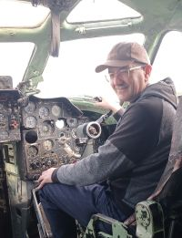

#Традиционное "Hello World!"

Меня зовут Виктор.
Недавно я решил сменить сферу деятельности и стать тестировщиком ПО. До этого был опыт внедрения таких систем как **Incident management** и **Fault management** и их тестирование на соответствие ТЗ в качестве заказчика.

И сейчас я учусь в Нетологии на инженера по тестированию.

